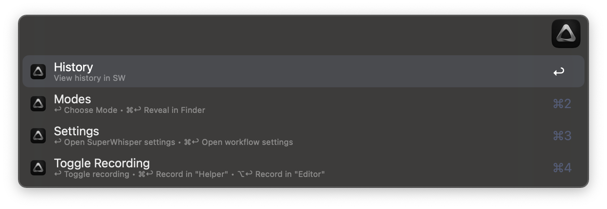
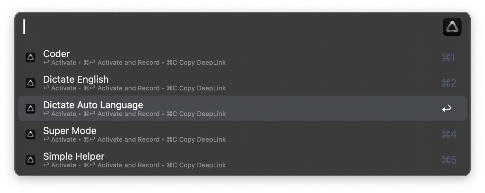

<h1 align="center">Superwhisper for Alfred</h1>

<strong>Use Alfred to Control <a href="https://superwhisper.com/">Superwhisper</a> - AI Powered Voice to Text</strong>

    

<em><a href="https://youtu.be/mUcijTpWYAQ">~ Video Overview & Setup ~</a></em>

## ABOUT
This Alfred workflow is designed to enhance your experience with [Superwhisper](https://superwhisper.com/), an INCREDIBLE AI-powered text tool that offers dictation/transcription capabilities and access to both local and cloud language models. Please note that this workflow is not official and serves as an alternative for controlling Superwhisper efficiently.

---

  

## MAIN FEATURES
- Quickly **open Superwhisper's settings**.

- **Change recording modes** with ease.

- **Start or stop recording** directly from within Alfred.

- **Activate and start recording** in a specific mode instantly.

- **Customizable hotkeys** to activate and record in user-defined modes.

- Use Alfred’s text view to **check history items from Superwhisper, to see a parsed version of their JSON file (convenient for debugging), or draft editing your results**.

- **Filter your recording history by results or by voice.** Once filtered by result or by voice you can also filter by date (MM/dd). You can also reprocess any audio in history by pressing and holding CMD + SHIFT.

- Quickly **reprocess your most recent dictation with your current mode**, by pressing CMD + SHIFT when selecting the "History" option in the main menu.

- **Set two favorite modes and quickly start recording** on them from the main menu (or with custom hotkeys/external trigger).

- While on the main menu, **press CMD C on any option to copy the last Superwhisper result to your clipboard**, or press CMD Y to have a ‘quick-look’ of your JSON file.

- Fully control the workflow using **Alfred's bar, keyboard shortcuts, or an external trigger.**

- Alfred's actions for **processing audio files with Superwhisper** and for **clean rendering of Superwhisper's JSON files with Alfred's Textview**.

- **Supports fuzzy search and filtering.** This allows you to—for example—filter ‘Super Mode’ by simply typing ‘sm’ while in the modes menu.

- **Optional 'copySelect helper'.** If recording is triggered by using the Workflow and the user has text selected, it will be copied to the clipboard. This is particularly useful for users that have modes with the 'use copied text' feature in Superwhisper; if no text is selected when triggering the recording nothing will happen.
  
- If you have [Keyboard Maestro](https://www.keyboardmaestro.com/), [Macrowhisper](https://by.afadingthought.com/macrowhisper) allows the **display of your current mode on the Menu Bar. This also includes action modes, web searchess, and custom automations** (experimental).

*NOTE: Some workflow configuration options marked as experimental rely on AppleScript, and compatibility with system in languages other than English may vary.* 

---
## REQUIREMENTS

* [Superwhisper](https://superwhisper.com/) has to be running.

* The "Copy Selected Text" option in the workflow's configuration will copy selected text from Arc & Safari using Javascript. For this to work in Safari a few extra steps are necessary: Open Safari Settings, go to Advanced section, enable "Show Develop menu in menu bar", and in the Develop menu, select "Allow JavaScript from Apple Events". This option just makes the native SW functionality more reliable, especially in these two browsers where accessibility seems to not always work.

* **Additional optional/experimental features require [Keyboard Maestro macro group](https://by.afadingthought.com/macrowhisper).** If you don't have Keyboard Maestro installed, avoid activating this option in the Workflow's configuration to prevent potential errors.

---

  

## HOW TO
Controlling this workflow is straightforward, but there are some things to consider:

* All available custom Hotkeys have notes to indicate their function.
* 
* The main menu, modes, and history menus have additional options with modifiers. Make sure to read and familiarize yourself with these to make the most of the workflow.

* For the History Filters, there's a secret modifier combination, CMD + OPT + RETURN. This will copy your system prompt, together with your dictation, and the result. Works for items opened on Alfred's text view as well.

* Alfred's script filter features, such as CMD L for large text, CMD Y to quicklook a file, CMD C to copy, and [Alfred Actions](https://www.alfredapp.com/help/features/universal-actions/), have been integrated into the workflow and perform different functions depending on the current menu.
	* While on the main menu, all the above will perform actions on the latest result or its JSON file.
	* While on the modes menu, CMD C will copy its deep link, CMD Y and Alfred Actions will lead to the JSON configuration file of the selected mode. This allows for easy revealing of the mode, duplicating it, directly opening it and modifying it, etc. *If you modify the mode's JSON file directly, a restart of Superwhisper may be required for the changes to take place.*
	* While on the History filters, CMD C will copy the filtered item (voice or AI), CMD L will show it in Large Text, CMD Y and Alfred Actions will act directly on its JSON file.

* Hotkeys have been color-coded as follows:
  * Blue: Quick access to the workflow menus and its main options.
  * Yellow: Non-essential, but convenient for pro-users.
  * Orange: They activate and record in specific modes.
  * Green: Snippets for pasting the last voice, result, both, or including system prompt.

* The "copySelect" helper tool which is activated in the workflow configuration works like other Superwhisper features that use your system's accessibility API (with the exception of when using Arc or Safari, where it uses Javascript). Depending on your front app, the accessibility features may or may not be fully supported or work as expected. That's why I suggest using the Keyboard Maestro macros together with this config setting - as it will show you clearly if the tool successfully copied your selected text or not.

---
### “CUSTOM MODE” HOTKEYS
In addition to the two favorite modes and super mode hotkeys, users can set up six additional hotkeys. If you need more than six or require options—like activating a mode without triggering record—, consider using [the external trigger.](#the-external-trigger) 

**To set up your custom hotkeys you need to:**
1. Open the modes menu in Alfred.
2. CMD C on your chosen mode to copy its deep link.
3. Go into Alfred’s settings, Superwhisper’s workflow editor, and double click the variables block (pink color-coded) next to the hotkey you want to setup. 
4. Paste the deep link in the right field of `theUrl`.
5. Double click the hotkey block and choose your favorite keyboard shortcut :)

**NOTE:** A better approach instead of setting these custom hotkeys within the Workflow, is to set them in a separate workflow, such as [this one.](https://github.com/user-attachments/files/19871158/Superwhisper.Triggers.zip) This prevents potential functionality loss with future workflow updates.

---
### THE EXTERNAL TRIGGER
Using [the external trigger](https://www.alfredapp.com/help/workflows/triggers/external/) provides total control over this workflow's features, whether you're automating tasks, maximizing functionality, or seeking additional custom hotkeys. You can utilize the external trigger through either Alfred's AppleScript or URL scheme. 

> This workflow’s external trigger is `sw` .

**To activate and/or record with different modes, `sw` expects the following parameters comma separated:**
`[action],[deepLink],[modeName]`

**Use those placeholders as follows:**
* `[action]` can be `openModeRecord` to activate and record, or `openMode` to simply activate the given mode.
  * **There is an exception.** If you want to trigger 'Super Mode’ externally, `[action]` can be `activateSuperM`, or `activateRecordSuperM` . No additional arguments are necessary for this case.
* You can grab the `[deepLink]` of your mode as mentioned above, from within the modes menu.
* `[modeName]` is only used for the notifications, in those cases that you activate the mode without recording.

**Examples:**
* `openModeRecord,superwhisper://mode?key=custom-HWEE` 
* `openMode,superwhisper://mode?key=custom-HWEE,Dictate in English` 
* `activateSuperM`

  
<b>👇️ Additionally, `sw` can receive any of the the following arguments by itself:</b>

| The Argument         | The Action                                                   |
|----------------------|--------------------------------------------------------------|
|                      | If there’s no argument sent. The main menu of the workflow will open. |
| `selectMode`         | Opens the modes menu.                                        |
| `selectHistoryResult`| Opens History Filtered by result.                            |
| `selectHistoryVoice` | Opens History Filtered by voice.                             |
| `settings`           | Opens Superwhisper’s settings.                               |
| `wsettings`          | Opens the workflow’s configuration window.                   |
| `revealModes`        | Reveals the modes folder in Finder.                          |
| `record`             | Toggles Recording                                            |
| `activateRecordFavA` | Activates and records on favorite mode “A”                   |
| `activateRecordFavB` | Activates and records on favorite mode “B”                   |
| `history`            | Opens history tab in Superwhisper                            |
| `viewLastResult`     | Opens the last result in Alfred’s Text View. It will try to get the LLM Result. If no LLM was used, it will get the transcribed dictation. |
| `editLastResult`     | Opens a temporary edit view with the last result.            |
| `copyLast`           | Copies the last result to your clipboard.                    |
| `processLast`        | Reprocess the most recent audio file.                        |
| `viewLastJSON`       | Opens a parsed version of the last JSON file in Alfred’s Text View. |
| `revealJson`         | Reveals the last JSON file in Finder.                        |

> If you use Superwhisper's feature to include clipboard text as context for AI, the workflow has a built-in copySelect small CLI tool which you set in the configuration of the workflow (and is—optionally—activated when using Alfred to start a recording), but you can also use the external trigger `copySelect` for this. When triggered, it checks if you have text selected - if you do, it copies it to your clipboard. If nothing is selected, it does nothing. You can map this to the same keyboard shortcut you use for Superwhisper using tools like Karabiner-Elements. This way, whether you use the workflow or Superwhisper's default shortcut to record, selected text will always be copied automatically.

---
## CLOSING
Please be aware that since this workflow is non-official, it may require occasional fine-tuning due to updates or unforeseen bugs. Your feedback and contributions are highly appreciated to improve its functionality.

For advanced users wanting to get more out of Superwhisper, [Karabiner-Elements](https://karabiner-elements.pqrs.org/) is a great tool to explore. This app lets you remap keys which you could use to activate custom modes, move your recording trigger anywhere you want, create advanced shortcuts without using common ones, and set up complex key combinations. As an example, I currently use F+G keys to start recording (which also works with press-and-hold for quick dictations). I also have an entire layer on my keyboard's layer with letter "a" to move around different modes, preview/edit my last result with Alfred, toggle actions of the KM macros, or quickly jump to different menus of the workflow. I do all of this without loosing any common modifier combination.

*If you found this workflow useful, how about [buying me a coffee](https://www.buymeacoffee.com/afadingthought)?*